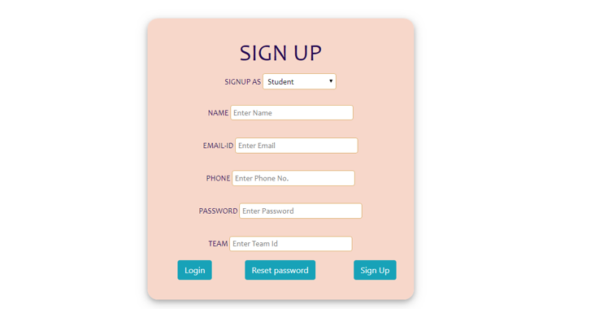

# Startup Mentoring Website 👨‍🏫

    

## <a name="system">What does it include?</a>

**Startup Mentoring Website** is created to help and support the startups of various domains initiated by the budding entrepreneurs by getting guidance from the mentors or experts of that field and getting financial support from the funders. It has various features that include communicating with mentors through chat page, daily updates on news, webinars, blogs and forums to discuss their startup related doubts. Lastly, it has chatbot to solve user queries developed using DialogFlow.

You can check the app version of this same system [here](https://github.com/ekta18/Mentorup).

---

## <a name="system">Tech Stack Involved?</a>

**FRONTEND**
- HTML
- CSS
- Bootstrap

**BACKEND**
- PHP
- Javasript
- MySQL

---

## <a name="Results?">Results?</a>

<table style="width:2800px; border: black; margin: 0px auto;" class="skinny" cellspacing="0" cellpadding="0">
    <tr>
        <td>
            
        </td>
        <td>
            
        </td>
        <td>
            
        </td>
        <td>
            
        </td>
    </tr>
    <tr>
        <th>Home Page(a)</th>
        <th>Home Page(b)</th>
        <th>Home Page(c)</th>
        <th>Home Page(d)</th>
    </tr>
    <tr>
        <td>
            
        </td>
        <td>
            
        </td>
        <td>
            
        </td>
        <td>
            
        </td>
    </tr>
    <tr>
        <th>Login page</th>
        <th>Register Page</th>
        <th>Team Register Page</th>
        <th>Footer</th>
    </tr>  
    <tr>
        <td>
            
        </td>
        <td>
            
        </td>
        <td>
            
        </td>
        <td>
            
        </td>
        <td></td>
        <td></td>
    </tr>
    <tr>
        <th>Announcement Page</th>
        <th>Blogs Page</th>
        <th>Domain Page(a)</th>
        <th>Domain Page(b)</th>
    </tr>
    <tr>
        <td>
            
        </td>
        <td>
            
        </td>
        <td>
            
        </td>
        <td>
            
        </td>
    </tr>
    <tr>
        <th>Mentor's Desk</th>
        <th>Funder's Desk</th>
        <th>Chat Page</th>
        <th>Chatbot</th>
    </tr>  
</table>

---
